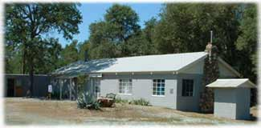
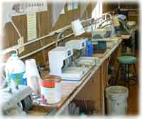
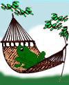

# Monthly Meetings

The Calaveras Gem & Mineral Society holds meetings on the **third Sunday of the month**. At each club meeting there is a potluck, business meeting, main presentation, and members share other interesting information about the hobby.

## Meeting Details

**General Meeting:** Third Sunday of each month - 11AM to 2PM

**Shop time for club members** is on a regular schedule of Saturdays, 10AM to 2PM

### Clubhouse Location

The Calaveras Gem and Mineral Society's clubhouse is nestled among the oak trees in the Mother Lode foothills near Angels Camp, California.

- [MAP TO CLUBHOUSE](map_clubhouse.html)
- [CLUB HISTORY](history.html)
- [MEMBERSHIP](membership.html)
- [MEMBERS AREA](members.html)

## Activities

### Lapidary Shop

The club has a lapidary shop, which includes several rock and trim saws, cabbing units and polishers.

Regular shop hours are on Saturdays, 10AM to 2PM. During this time, club members can provide instruction for other members or work on their own projects.

[MORE SHOP INFORMATION](shopschedule.html)
[MORE ABOUT LAPIDARY](lapidary.html)

### Field Trips

The club is working on dates for future field trips. In addition to sponsoring its own field trips, its members are welcome to attend trips hosted by other Field Trip Chairmen's Association ("Co-op") clubs and the California Federation of Mineralogical Societies (CFMS).

[MORE ABOUT FIELD TRIPS](field.html)

### Gem Show

At our shows, vendors sell mineral specimens, jewelry, gems, beads, fossils, petrified wood, lapidary material, meteorites, tools and supplies for making jewelry and more.

Our show includes a kid's area, exhibit cases, demonstrations, silent auctions, door prizes and a raffle. Admission is $7.00 per person. Kids under 12 are free with an adult.

[MORE ABOUT OUR SHOW](show.html)

### Tailgate Swap

The club hosts a tailgate swap twice a year. This is a very fun event that is held at our clubhouse. Club Members bring their items to the parking lot of the clubhouse for all to buy, sell or swap.

[MAP TO CLUBHOUSE](map_clubhouse.html)

